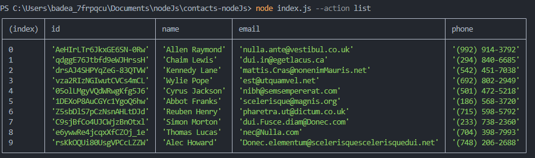
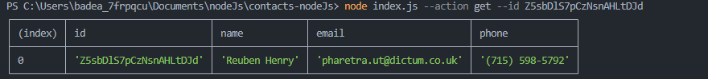
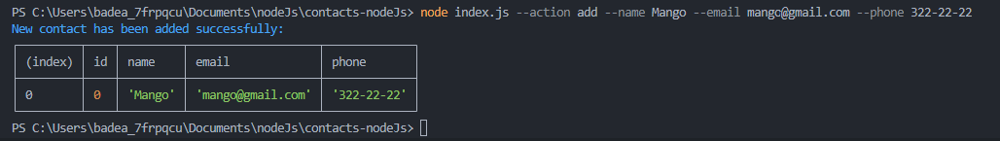
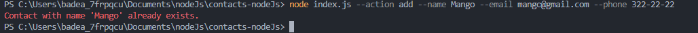
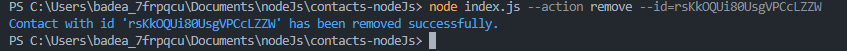

# contacts-nodeJs

This CLI allows you to manage your contacts through a command line interface. You can list all contacts, display a contact by its ID, add new contacts and remove contacts.

# Usage Examples: 

Add concrete examples of commands that users can use to interact with the application:

1️⃣ List all contacts ▶️ node index.js --action list
()
(https://ibb.co/DQM3xS7)
2️⃣ Get a contact by ID ▶️ node index.js --action get --id Z5sbDlS7pCzNsnAHLtDJd
()
(https://ibb.co/X8MQyXk)
3️⃣ Add a new contact ▶️ node index.js --action add --name Mango --email mango@gmail.com --phone 322-22-22
()
(https://ibb.co/qryzWYj)
()
(https://ibb.co/HxxjQpm)
4️⃣ Remove a contact by ID ▶️ node index.js --action remove --id=rsKkOQUi80UsgVPCcLZZW
()
(https://ibb.co/wKcrvTP)
